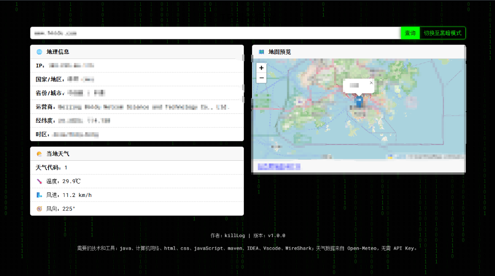

前置条件：

1.需登录自己的社交软件

2.需打开wireshark，监听自己正在用的网卡

3.waireshark过滤条件：

```bash
(data.len == 72 && udp) && !(icmp.type == 3 && icmp.code == 3)
```

--

测试步骤：

1.需要好友实际在线才行（不管对方隐身还是干啥，只要手机或者电脑登录就行，这个测试一下wireshark有内容输出就行）

2.给想要定位的社交软件好友拨打一个语音电话

3.复制wireshark里面输出的目标ip

4.启动该项目的前后端程序

5.输入对方ip进行查询

--

注意：
由于都是使用的免费接口，因此只能玩一玩哈，更详细的违法且需要钱

（当然你要是会爬*，以及直接**付费ip定位的xx服务器植入mm程序另说）

免责声明：

仅用于本地环境下的经用户/好友允许的情况下才能用来做安全测试，请勿用于非法测试，仅用来学习，帮助理解计网和编程！！！

